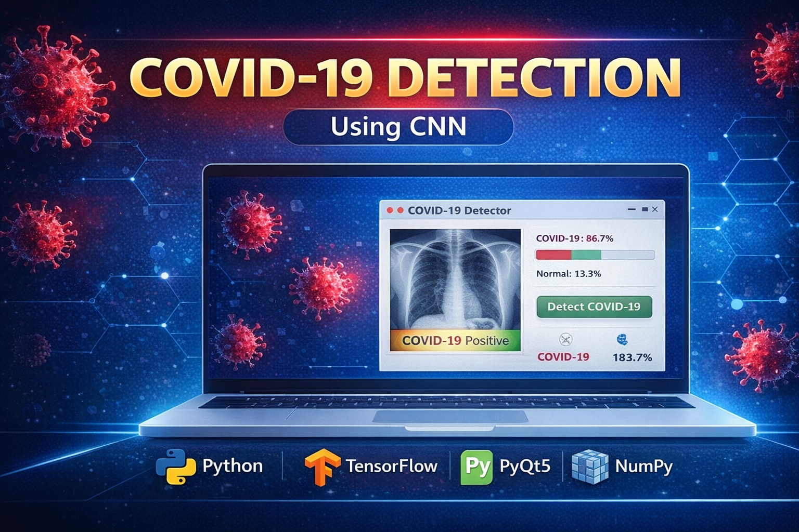

<p align="center">
  
</p>

# 🦠 COVID-19 Detection using CNN

## 📌 Overview
This project detects COVID-19 from chest X-ray images using a Convolutional Neural Network (CNN).  
It includes a PyQt5-based GUI for real-time image classification.

---

## 🚀 Features
- CNN model for image classification  
- Detects COVID vs Normal cases  
- User-friendly GUI using PyQt5  
- Fast and accurate predictions  
- Real-time image input  

---

## 🛠 Tech Stack
- Python  
- TensorFlow / Keras  
- PyQt5  
- NumPy  

---

## 📊 Dataset
- Chest X-ray images  
- COVID-19 cases  
- Normal cases  

---

## 🧠 Model Used
**Convolutional Neural Network (CNN)**

### Why CNN?
- Best for image classification  
- Automatically extracts features  
- High accuracy for medical imaging  

---

## 🖥️ Application
- GUI built with PyQt5  
- Upload X-ray image  
- Predict COVID-19 status instantly  

---

## ▶️ Run the Project
```bash
pip install tensorflow pyqt5 numpy pillow
python main.py

🔗 Links
💼 LinkedIn: https://www.linkedin.com/in/senthamil45
🌍 Portfolio: https://senthamill.vercel.app/
💻 GitHub: https://github.com/selvan-01/covid19-detection-using-cnn
